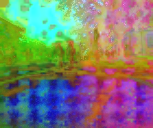
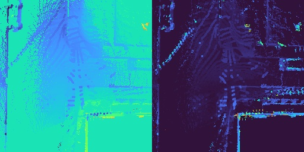
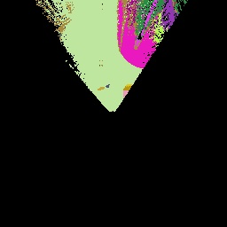

# 📦 Preparing the RGB-D Backbone Dataset

### RGB-D Inputs

First, we will need to prepare the RGB-D inputs for CREStE. Run the following command to project the LiDAR point clouds onto the camera frames and generate the depth map inputs. You should see the depth maps under `data/creste/depth_0_LA_all` in the data directory `data/creste`.

```bash
python scripts/preprocessing/build_dense_depth.py --cfg_file ./configs/dataset/creste.yaml --out_dir ./data/creste --scans 0 --proc LA --dataset_type all
```

### Depth Labels
We provide a straightforward way to generate ground truth dense depth labels for CREStE by performing edge-aware bilateral filtering on the depth maps from the original dataset. This process is implemented in the `build_dense_depth.py` script.

```bash
python scripts/preprocessing/build_dense_depth.py --cfg_file ./configs/dataset/creste.yaml --out_dir ./data/creste --scans 0 --proc LAIDW --dataset_type all
```

After running the command above, you should see ground truth depth images under `depth_0_LAIDW_all` in the data directory `data/creste`. Next, run the following script to downsample the depth images for efficient training.

```bash
python scripts/preprocessing/downsample_frames.py --seq 0 1 2 3 4 5 6 7 8 9 10 11 13 14 15 17 19 20 --ds 4 --root_dir ./data/creste
```

### Foundation Model Feature Labels
Next, we will need to extract image features using a foundation model. We use Dinov2 to extract features in the command below, but any other foundation model can be used as long as it supports image feature extraction.

```bash
python scripts/preprocessing/create_pe_dataset.py --input_dir data/creste --output_dir data/creste --model_type dinov2 --img_shape 512,612 --feat_dim 128
```

Once the script is complete, the extracted features can be visualized under the `data/creste/dinov2_vitb14_128_rgb` directory. Here is an example of the extracted features for a specific frame:



# 📦 Preparing the BEV Backbone Dataset

### SAM2 Instance Labels

Before generating the BEV backbone dataset, we need to install the SegmentAnythingv2 (SAM2) library. Follow the instructions in the [SAM2 repository](https://github.com/facebookresearch/sam2)

```bash
cd external
git clone https://github.com/facebookresearch/sam2.git && cd sam2
pip install -e .
```

After installing SAM2, we can generate the SAM2 instance labels with the following commands. The first is for generating static instance labels, and the second is for generating dynamic instance labels. Note: the following commands will run 4 parallel processes on each GPU, allocates jobs to up to 8 GPUs, and starts from GPU index 0. Adjust the parameters as necessary for your system.

```bash
./scripts/preprocessing/create_sam_creste.sh 4 8 0 static
./scripts/preprocessing/create_sam_creste.sh 4 8 0 dynamic 
```

### BEV Map Labels


Run the following command to generate the BEV elevation map labels. The command will generate the elevation map for each frame in the dataset and save it under `data/creste/sam2_map`.
```bash
python scripts/preprocessing/build_feature_map.py --cfg configs/dataset/distillation/creste_pefree_dinov2.yaml --out_dir data/creste/sam2_map --feat_type geometric --tasks elevation --vis --feat_dir data/creste/sam2
```

You should see a similar elevation map as shown below for sequence 1 frame 2375.



Before constructing BEV SAM2 static and dynamic instance masks, we will need to install `cuml` to perform efficient clustering. You can install it to your python environment using the following command. Note the command below assumes you have a CUDA 12 compatible GPU and the `cuml` version is compatible with your CUDA version. Adjust the version as necessary.

```bash
pip install \
    --extra-index-url=https://pypi.nvidia.com \
    "cuml-cu12==25.4.*"
```

After installing `cuml`, we can construct the BEV SAM2 static and dynamic instance masks with the following command.

```bash
python scripts/preprocessing/build_sam_map.py --indir data/creste --outdir data/creste/sam2_map --img_ds 1
```

You should see a similar static instance map as shown below for sequence 1 frame 2375.



Congrats! You have successfully prepared the RGB-D and BEV backbone datasets for CREStE.

# 📦 Preparing the Reward Function Dataset

Run the following command to generate the traversability dataset for the reward function. The command will generate traversability labels for each frame in the dataset and save it under `data/creste/traversability`.

```bash
python scripts/preprocessing/create_traversability_dataset.py --indir ./data/creste --outdir ./data/creste/traversability
```
