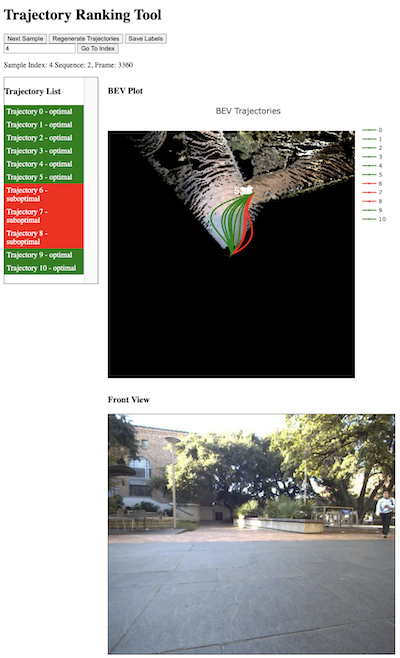

# 📊 Training

## Third Party Dependencies
We use the [EfficientNet-PyTorch](https://github.com/lukemelas/EfficientNet-PyTorch) library for the RGB-D backbone. Install it using the following command:

```bash
pip install efficientnet_pytorch
```

Before proceeding, make sure that you completed **ALL** of of the data preprocessing steps in 

### 📷 RGB-D Backbone

Generate training and validation splits for the RGB-D backbone. The splits will be saved in `data/creste/splits`.
```bash
python scripts/preprocessing/build_splits.py --split_type standard --cfg_file configs/dataset/distillation/creste_pefree_dinov2.yaml --out_dir data/creste/splits --horizon 50 --hausdorff 0 --min_distance 0
```

Run the following command to train the RGB-D backbone model. The model checkpoints will be saved under `model_ckpts/Dinov2Distillation`.

```bash
python creste/train_pefree.py 'dataset=distillation/creste_pefree_dinov2' 'model=distillation/effnet_ds2_dinov2_128' 'trainer=standard_single' 'model.batch_size=16' '+wandb_name=creste_mini'
```

### 🗺️ BEV Backbone
Next, we provide a sample command to train the BEV backbone model using SAM2 instance labels and elevation maps. Make sure to set the `VISION_BACKBONE_WEIGHTS_PATH` environment variables point to your weights path from the RGB-D backbone training step. 

```bash
export VISION_BACKBONE_WEIGHTS_PATH=model_ckpts/Dinov2Distillation/EffNet_Depth_DS2_BB_efficientnet-b0_Head_depthconv-head_lr_0.000500_UD_LAIDW_v2/20250601/170206/Adam-epoch\=49.ckpt
```

Launch the training script with the following command. This will use a single gpu and consume ~40GB of GPU memory. Adjust the `batch_size` parameters as necessary for your system. Note, this command will freeze the RGB-D backbone for the first 5 epochs and then unfreeze it for the rest of the training. 

```bash
python creste/train_ssc.py 'trainer=standard_single' 'model.batch_size=16' '+model.freeze_backbone_epochs=5' 'model.optimizer.lr=0.0005' '+wandb_name=creste_urban_sam2elev_jointdinov2' model.vision_backbone.weights_path=$VISION_BACKBONE_WEIGHTS_PATH
```

### 🏆 Reward Function
Finally, we provide a sample command to train the reward function. Our training procedure is comprised of three steps:
1. **Training a base reward function** using MaxEnt IRL with the pretrained BEV backbone.
2. **Annotating counterfactuals** for samples with high deviation from the expert demonstrations.
3. **Training the reward function** with the annotated counterfactuals using Counterfactual IRL.

Before training, we need to generate the daaset splits. After running the command below, the splits will be saved in `data/creste/splits/3d_sam_3d_sam_dynamic_elevation_traversability_counterfactuals_standard`. The following command will extract sequences of 50 frames with a 10 frame overlap. If you want to use curvature-based splits, you can set the `--split_type` to `curvature` and adjust the `hausdorff` and `min_distance` parameters accordingly. 

```bash
python scripts/preprocessing/build_splits.py --split_type standard --cfg_file configs/dataset/traversability/creste_sam2elevtraverse_horizon.yaml --out_dir data/creste/splits --horizon 50 --hausdorff 1.0 --min_distance 1.0 --split_type standard --overlap 10
```

To train the reward function without counterfactuals, modify the flags in the command below to `--zero_terminal_state True` and `--alpha 0.0`. Otherwise, you can run the command directly to train the reward function with counterfactuals. Make sure to set the `BEV_BACKBONE_WEIGHTS_PATH` environment variable to the path of the BEV backbone model checkpoint you trained in the previous step. 

```bash
export BEV_BACKBONE_WEIGHTS_PATH=model_ckpts/TerrainNetSAM/depth128UD_jointdinopretrain_sam2dynelev_supcon_joint_BB_efficientnet-b0_Head_depthconv-head_lr_0.000500_UD_LAIDW_v2/20250614/150349/Adam-epoch\=42.ckpt
```

```bash
./scripts/traversability/train_creste.sh --weights_path $BEV_BACKBONE_WEIGHTS_PATH --alpha 0.5 --reward_weight 1.0 --horizon 50 --trainer standard_single --split data/creste/splits/3d_sam_3d_sam_dynamic_elevation_traversability_counterfactuals_standard --zero_terminal_state False
```

### ✏️ Annotating Counterfactuals

To simplify counterfactual annotation, we provide a web-based annotation tool. You can run the annotation tool using the following command:

```bash
python scripts/traversability/rlhf/app.py
```

Once started, you can access the annotation tool in your web browser at `http://localhost:4242`. To annotate counterfactuals, simply click on the trajectories on the trajectory list on the left side of the screen. If you already have counterfactuals annotated, they will be loaded automatically. Finally, you can click on the `Save Labels` button to save the annotated counterfactuals to the output directory specified in the command line arguments. By default, counterfactuals will be saved in the `data/creste/counterfactuals` directory.



## 📦 Compiling CREStE for Realtime Deployment

To compile a pretrained model for realtime deployment, we provide a script that uses torch.jit to compile the model. The script will save the compiled model in the `model_ckpts/compiled` directory. Before running the script, make sure to construct a data dictionary for the model. You can do download an existing one by running the following command:

```bash
wget https://web.corral.tacc.utexas.edu/texasrobotics/web_CREStE/public_datasets/data_dict_creste_19_4830.pkl -O ./scripts/runtime/data_dict.pkl
```

Then, run the command below to compile the model. Make sure to set the `CKPT_PATH` environment variable to the path of the model checkpoint you want to compile. The compiled model will be saved as `scripts/runtime/creste_rgbd_trace.pt`.

```bash
export CKPT_PATH=model_ckpts/TraversabilityLearning/depth128UD_jointdinopretrain_sam2dynelev_supcon_joint_BB_efficientnet-b0_Head_depthconv-head_lr_0.000500_UD_LAIDW_v2/creste_terrainnet_dinopretrain_maxentirl_msfcn_sam2dynsemelev_headMaxEntIRL_horizon50/20250614/154206/Adam-epoch\=05.ckpt
python scripts/runtime/compile.py 'model=traversability/inference/terrainnet_maxentirl_msfcn_sam2dynsemelev' 'model.weights_path=$CKPT_PATH'
```

You are now ready to deploy CREStE on your robot using our C++ implementation of the [creste_realtime](https://github.com/ut-amrl/creste_realtime) repository. Cheers! 🎉